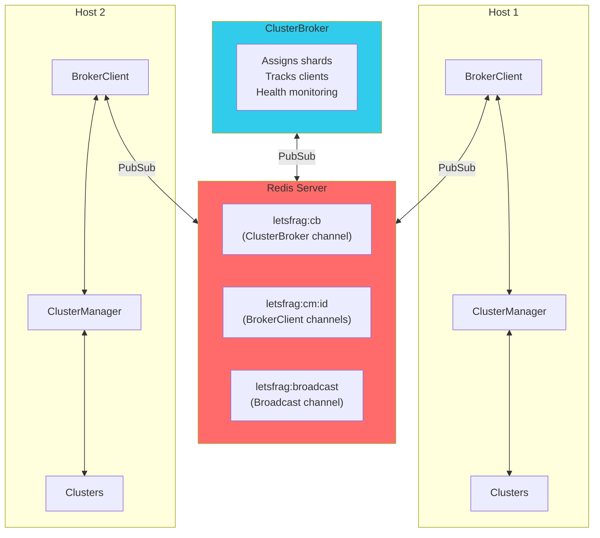

# About

This package is inspired by [discord-hybrid-sharding](https://github.com/meister03/discord-hybrid-sharding) and allows you to scale your Discord bot across multiple hosts/machines using Redis PubSub for inter-process communication.

## Architecture Overview



### How It Works

1. **ClusterBroker** runs on a separate machine and manages shard distribution
2. Each host runs a **BrokerClient** that connects to Redis and requests shards
3. **ClusterManager** on each host spawns clusters with assigned shards
4. All communication happens through **Redis PubSub** channels
5. **Heartbeat system** monitors client health

## Key Features

-   **Redis PubSub**: Fast, reliable inter-process communication using Redis
-   **Distributed Architecture**: Scale across unlimited hosts/machines
-   **Automatic Shard Distribution**: ClusterBroker automatically assigns shards to available hosts
-   **Health Monitoring**: Automatic detection and cleanup of dead clients
-   **Hot Reload**: Add or remove hosts without restarting the entire system
-   **Type-Safe**: Full TypeScript support with proper typings

# Links

-   [API Documentation](https://lacunahub.github.io/letsfrag)

# Installation

This package is hosted on GitHub Packages and requires authentication.

## Quick Setup

1. Create a [GitHub Personal Access Token](https://github.com/settings/tokens/new) with `read:packages` scope

2. Add to your shell profile (`.bashrc`, `.zshrc`, or `.profile`):

```bash
export GH_PKG_TOKEN=your_token_here
```

3. In your project directory, create `.npmrc`:

```
@lacunahub:registry=https://npm.pkg.github.com/
//npm.pkg.github.com/:_authToken=${GH_PKG_TOKEN}
```

4. Install:

```bash
npm install @lacunahub/letsfrag
```

### Alternative: npm login

Authenticate once with GitHub Packages:

```bash
npm login --registry=https://npm.pkg.github.com --scope=@lacunahub
# Username: your-github-username
# Password: your-personal-access-token (with read:packages scope)
# Email: your-email
```

Then install normally:

```bash
npm install @lacunahub/letsfrag
```

See [Working with the npm registry](https://docs.github.com/en/packages/working-with-a-github-packages-registry/working-with-the-npm-registry) for more information.

# Usage

## Prerequisites

You need a Redis server running. You can use Docker:

```bash
docker run -d -p 6379:6379 redis:latest
```

## File structure

```
├── src
│   ├── client.ts
│   ├── cluster.ts
│   └── broker.ts
└── package.json
```

```ts
import { ClusterBroker } from '@lacunahub/letsfrag'

const broker = new ClusterBroker({
    redis: 'redis://localhost:6379', // or { host: 'localhost', port: 6379 }
    hostCount: 2,
    shardCount: 80,
    botToken: process.env.BOT_TOKEN
})

broker.on('connect', client => console.info(`Client "${client.id}" connected`))
broker.on('disconnect', (client, reason) => console.warn(`Client "${client.id}" disconnected: ${reason}`))
broker.on('error', err => console.error(err))
broker.on('ready', () => console.info('ClusterBroker is ready'))

broker.initialize()
```

`src/cluster.ts` (Run on each host)

```ts
import { ClusterManager } from '@lacunahub/letsfrag'

const clusterManager = new ClusterManager(`${__dirname}/client.js`, {
    broker: {
        redis: 'redis://localhost:6379',
        type: 'bot'
    },
    spawnDelay: 10_000
})

clusterManager.on('clusterCreate', cluster => console.info(`Cluster #${cluster.id} has been created`))
clusterManager.on('ready', manager => console.info(`Manager with clusters (${manager.clusters}) is ready`))

clusterManager.spawn()
```

`src/client.ts`

```ts
import { ClusterShardClient } from '@lacunahub/letsfrag'
import { GatewayIntentBits } from 'discord.js'

const client = new ClusterShardClient({
    intents: [GatewayIntentBits.Guilds]
})

client.login()
```

_**Note**: The ClusterBroker must be started before `ClusterManager` is initialized on each host._

# License

This project is licensed under the [MIT License](https://github.com/LacunaHub/lavaluna.js/blob/master/LICENSE).
